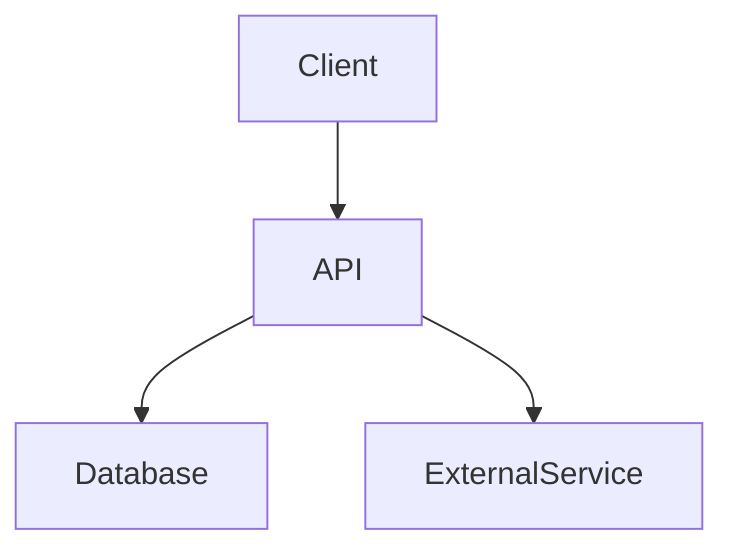

<br />
<div align="center">
  <a href="https://github.com/dein-user/repo-name">
    
  </a>

  <h1 align="center">[Projekt Titel]</h1>

  <p align="center">
    <strong>[Ein knackiger Slogan: Was macht das Projekt in einem Satz?]</strong>
    <br />
    <a href="#demo">Demo ansehen</a>
    ·
    <a href="https://github.com/dein-user/repo-name/issues">Fehler melden</a>
    ·
    <a href="https://github.com/dein-user/repo-name/issues">Feature vorschlagen</a>
  </p>
</div>

<div align="center">


</div>

<details>
  <summary><strong>Inhaltsverzeichnis</strong> (Klicken zum Ausklappen)</summary>
  <ol>
    <li>
      <a href="#-über-das-projekt">Über das Projekt</a>
      <ul>
        <li><a href="#-technologie-stack">Technologie Stack</a></li>
        <li><a href="#-architektur">Architektur</a></li>
      </ul>
    </li>
    <li>
      <a href="#-getting-started">Getting Started</a>
      <ul>
        <li><a href="#voraussetzungen">Voraussetzungen</a></li>
        <li><a href="#installation">Installation</a></li>
        <li><a href="#konfiguration">Konfiguration</a></li>
      </ul>
    </li>
    <li><a href="#-nutzung">Nutzung</a></li>
    <li><a href="#-testing">Testing</a></li>
    <li><a href="#-deployment">Deployment</a></li>
    <li><a href="#-roadmap">Roadmap</a></li>
    <li><a href="#-mitwirken">Mitwirken</a></li>
    <li><a href="#-lizenz">Lizenz</a></li>
    <li><a href="#-kontakt">Kontakt</a></li>
  </ol>
</details>

---

## 📖 Über das Projekt


[Hier folgt eine detaillierte Beschreibung des Projekts. Welches Problem löst es? Warum ist diese Lösung besser als andere? Für wen ist dieses Projekt gedacht?]

### ✨ Hauptfunktionen
* **[Feature 1]**: [Kurze Erklärung]
* **[Feature 2]**: [Kurze Erklärung]
* **[Feature 3]**: [Kurze Erklärung]

### 🛠 Technologie Stack

Dieses Projekt basiert auf folgenden Technologien und Bibliotheken:

| Bereich | Technologie | Grund |
| :--- | :--- | :--- |
| **Core** | [z.B. Python 3.10 / Angular 17] | [Warum diese Version?] |
| **Framework** | [z.B. Django / Spring Boot] | [Warum dieses Framework?] |
| **Datenbank** | [z.B. PostgreSQL / MongoDB] | [Performance/Struktur Gründe] |
| **Tools** | [z.B. Docker, ESLint] | [Containerisierung, Linting] |

### 🏗 Architektur


## 🚀 Installation

Schritte, um die Entwicklungsumgebung einzurichten:

```bash
# Repository klonen
git clone [https://github.com/dein-user/projekt-name.git](https://github.com/dein-user/projekt-name.git)

# In das Verzeichnis wechseln
cd projekt-name

# Abhängigkeiten installieren
npm install  # oder pip install -r requirements.txt
```
